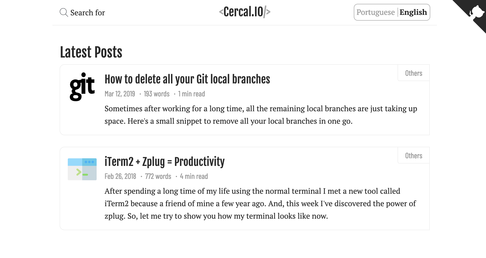

# jpcercal.com

Personal blog and website — [jpcercal.com](https://jpcercal.com/) in production,
per-PR previews at `https://staging.jpcercal.com/pr-<n>/`.

## A brief history of time

> Yes, I know that this title remembers a book title by Stephen Hawking, but at this case it’s about my blog. =)

Well, everything started in 2010 when I decided to have a blog, it has been a long time and many different things happened to myself on the way, however, this is a complete redesign of an old [Symfony](https://symfony.com/) project, that was migrated to [PhalconPHP](https://phalconphp.com/en/), then to [Wordpress](https://wordpress.org/) and finally to text based application (which is the status quo today).

Thanks to all of you for following me through this crazy things called life, to all free services available nowdays on the internet and for the effort that I’ve put on it, now I don’t have to pay anything to have this project running except the domain.

### Screenshots

Well, nothing better than a picture showing how the blog is rendered today, right?



## Architecture (target)

| Concern | Legacy | Target |
|---|---|---|
| SSG | Hugo 0.166.0 extended | Hugo 0.166.0 extended (kept) |
| CSS framework | Bootstrap 5.3.8 slim | Tailwind CSS v4 (Rust Oxide + LightningCSS) |
| SCSS compiler | Ruby Sass via grunt-contrib-sass | Dart Sass Embedded via Hugo Pipes |
| CSS minify | grunt-contrib-cssmin (Node) | LightningCSS (Rust) |
| HTML minify | grunt-contrib-htmlmin (Node) | `hugo --minify` (Go) |
| JS minify | grunt-contrib-uglify (Node) | esbuild (Go) |
| XML minify | grunt-xmlmin (Node) | `xmllint` (C) |
| Images | grunt-contrib-imagemin + svg2png/Inkscape | `oxipng` (Rust) + `mozjpeg` (C) + `resvg` (Rust) |
| Syntax highlight | Pygments (Python) | Chroma (Go, Hugo built-in) |
| Search | Lunr.js 2.3.9 + `search.json` | Pagefind (Rust, static, PT stemming) |
| Comments | Disqus (`cercal-io`) | removed (no third-party comments) |
| Analytics | Google Analytics 4 | removed (no third-party analytics) |
| Lint | csslint/jshint/VNU (Java) | Biome (Rust) + `html-validate` via Bun |
| Link check | — | `lychee` (Rust) |
| Perf audit | grunt-pagespeed (dead API) | `lhci` via Bun |
| E2E | — | Playwright |
| File ops | grunt clean/concat/copy/processhtml/watch | Hugo (Go) + `cp`/`rm` |
| Vendor fetch | `napa` over retired `git://` | removed (no vendor clones left) |
| Runtime | Node 20 + Ruby + Java 8 + Python + Inkscape | Node 24 (+ `fnm` Rust / `bun` Zig alt), static native binaries only |
| Hosting (prod) | `gh-pages` branch via GitHub Pages | Cloudflare Pages Direct Upload (`wrangler pages deploy public`) |
| Hosting (staging) | — | `gh-pages` branch repurposed staging-only, path-based per PR |

Toolchain preference order: **native C/Rust binary > Go > Node/Bun**.
See [AGENTS.md](AGENTS.md) for the locked decisions and rationale.

Baseline repo size: 384 tracked files (`content` 234 — 70 post bundles,
`assets` 53, `layouts` 27, `grunt` 23, `grunt-custom` 10).
At ~1 post/day the deployed file count stays ~1.5–2k/yr — far below the
Cloudflare Pages 20k-file limit.

## Local development

Prerequisites: [fnm](https://github.com/Schniz/fnm) (or Node 24+), Hugo
extended 0.166.0, optionally [bun](https://bun.sh/).

```shell
fnm use          # pins Node 24 (see .node-version)
npm ci           # or: bun install
hugo server      # live preview at http://localhost:1313
```

Production-equivalent build:

```shell
hugo --minify && npx pagefind --site public
```

Design-system preview (staging-only docs, lives outside `content/`):

```shell
cp -r design-system content/design-system && hugo server --buildDrafts
```

## Deploy

- **Production** (`push` to `master` only): CI builds (`hugo --minify` +
  `pagefind`), the blocking `cloudflare-pages` verification job runs, then
  `wrangler pages deploy public --project-name=jpcercal-com` publishes to
  `jpcercal.com`. Unlimited static deploys — no Pages build quota consumed.
- **Staging** (every PR): CI builds with
  `--baseURL https://staging.jpcercal.com/pr-<n>/` and publishes that path to
  the `gh-pages` branch. Never touches the Pages project or production.
- **DNS** (Cloudflare): apex → Pages project; `CNAME staging → <user>.github.io`
  (proxied) with the `gh-pages` custom domain set to `staging.jpcercal.com`.

## Verification

The `cloudflare-pages` CI job runs on production builds only and **blocks**
the deploy. It asserts, accepting `br` or `zstd`:

1. Compression served for html/css/js
2. HTTP/2 + HTTP/3 (`alt-svc: h3`) headers
3. Immutable long-cache + fingerprinted asset names
4. TTFB < 1.0s median
5. Payload budgets (no `search.json`, no unminified bundles, no
   Google+/Disqus/GA remnants; file count within limits)
6. SEO (robots, `sitemap.xml` via `xmllint`, Pagefind index, `hreflang`,
   JSON-LD, `og:image`)
7. `lychee` link check + `html-validate`
8. LHCI performance ≥ 90

plus a summary table. Staging PRs get a light non-blocking presence check
only (`200` on the PR path, including `/design-system/`).

## Project history

The full commit path lives on `chore/modernize-architecture` (single PR,
stacked revert-safe commits, deploy last):

0. docs (this README + `AGENTS.md`) → 1. tooling baselines → 2. napa out →
3. CSS (Tailwind + Dart Sass + Less port) → 4. JS modules + esbuild →
5. html/xml → 6. images → 7. highlight + lint → 8. Pagefind → 9. SEO/perf →
10. privacy → 11. design-system → 12. deploy (Pages prod + gh-pages staging +
DNS/CNAME) → 13. slim native-only image, green build.
