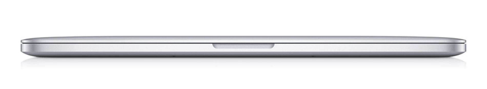
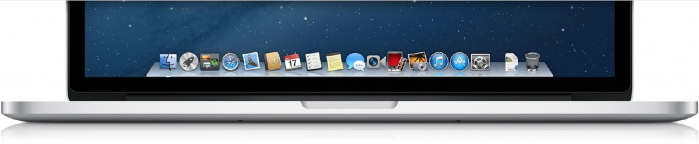

Todos os dias novos produtos são criados, alguns se destacam outros nem tanto. Recentemente realizei a compra do 
revolucionário MacBook Pro de 15 polegadas com tela Retina.

A linha de produtos da Apple é muito bem respeitada no mercado, a qualidade do produto é excelente, digo isto desde a 
sua caixa.

O novo MacBook Pro, é um notebook bastante leve, sendo que, possuí espessura de 1,8 centímetro e pesa apenas 2 quilos, 
o mesmo que o modelo de 13 polegadas.

Alguns pontos que me fizeram pensar antes de compra-lo foram:

* Dificuldade de atualização de hardware e Preço (principalmente)
* Ausência de drive de _CD/DVD_ e Porta _Ethernet_

Sinceramente, não sinto falta do drive óptico e da porta _Ethernet_.

Um portátil que não abandona a performance característica da linha "Pro". Abaixo apresento as configurações do 
equipamento que comprei:

* **Sistema Operacional**: _OS X 10.8.2 Mountain Lion_
* **Processador**: _Intel Core i7 2.3 Ghz_
* **Memória**: _8 GB DDR3 1600 Mhz_
* **Resolução**: _2880×1800_
* **Gráficos**:
  * _Intel HD Graphics 4000_
  * _NVIDIA GeForce GT 650M com 1GB de memória GDDR5 e alternância automática de processadores gráficos_
* **Armazenamento**: _SSD 256 GB_
* **Tamanho e Peso**:
  * _Altura: 1,8 cm (0,71 polegadas)_
  * _Largura: 35,89 cm (14,13 polegadas)_
  * _Espessura: 24,71 cm (9,73 polegadas)_
  * _Peso: 2,02 kg_
* **Camera**: _Câmera FaceTime HD de 720p_
* **Teclado e trackpad**:
  * _Teclado padrão retroiluminado, com 78 (EUA) ou 79 (ISO) teclas, incluindo 12 teclas de função e 4 teclas de 
  direção (disposição de "T" invertido) e sensor de luz ambiente_
  * _Trackpad Multi-Touch com controle preciso do cursor_
  * _Aceita as funções de rolamento inercial, esticar, girar, deslizar, deslizar com três dedos, com quatro dedos, 
  um toque, dois toques e arrastar_

Sem dúvidas, fiz a escolha certa, sempre fui louco para ter um Macbook, tentei com o _Hackintosh_ no meu _Dell XPS 15 
L502X_,mas, isso não chegou nem perto da performance da máquina original, entretanto, possibilitou o primeiro contato 
com o sistema operacional da Apple, o _Mountain Lion (10.8.x)_.

É uma máquina para uso profissional que aumenta a qualidade dos seus trabalhos e te deixa feliz, MUITO FELIZ!

Sou mais um fã da Apple, só não concordo com o preço praticado pela empresa de Cupertino aqui no Brasil.

> Se você pensa em adquirir um Macbook Pro, ou já possuí um produto Apple, por favor deixe um comentário para 
contribuir com quem ainda está com dúvidas.
