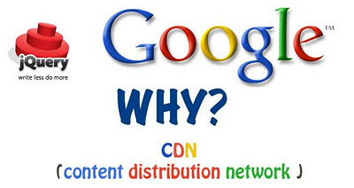

O _jQuery_ é uma biblioteca amplamente utilizada para o desenvolvimento web, sendo que, no _WordPress_ temos essa biblioteca incluída no pacote de instalação _default_.

Neste artigo, irei apresentar como e porque você deveria substituir o _jQuery_ _default_ do _WordPress_ pelo _jQuery_ do _Google CDN (Content Distribution Network)_.

**Mas porque você deveria substitui-lo?**

De um modo geral, você deve fazer isto para que o carregamento do script seja mais rápido para o usuário final.

Eis as questões que deveriam levar você a adotar esta prática.

**Caching**

Talvez o grande benefício de incluir o _jQuery_ hospedado pelo _Google_ está na chance de seus visitantes nem sequer precisarem realizar o download do _jQuery._ Isto ocorre porque, se um usuário já tiver visitado outro site que utilize o _jQuery_ hospedado pelo _Google_, ele já terá a biblioteca no cache do [browser]( "Navegadores ou Browsers") (navegador), desta forma, evitando uma nova requisição.



**Baixa Lantência**

O _Google_ tem o _jQuery_ distribuído geograficamente em vários servidores, sendo assim, quando um navegador requisita uma _URL_ para a biblioteca _jQuery_ o arquivo será baixado do servidor do _Google_ mais próximo da localização do usuário final.

**Requisições Paralelas**

Outra vantagem da utilização está no fato de que seu servidor não será sobrecarregado, e que haverá requisições paralelas para completar o ciclo de carregamento da página do seu website.

**Gratuito**

O principal motivo pelo qual você deveria utilizar este serviço está no fato de ele lhe trazer os benefícios citados acima e principalmente por ser gratuito.

**Como faço para substituir o jQuery default do WordPress?**

Isto é bem simples, primeiramente abra o diretório onde está localizado o tema que você está utilizando `/wp-content/themes/NOME-DO-SEU-TEMA/`. Logo após localize o arquivo chamado `functions.php`, e adicione as seguintes linhas ao final do arquivo:

```php
<?php
/**
 * Remove o jQuery utilizado pelo WordPress e adiciona
 * o jQuery do Google CDN nas páginas do Website.
 *
 * @author João Paulo Cercal <jpcercal@gmail.com>
 */
function jquery_from_google_cdn() {

  // Se a página carregada não for da área administrativa...
  if (!is_admin()) {

    // Remove o registro da biblioteca jQuery que é utilizada pelo WordPress
    wp_deregister_script('jquery');

    // Registra o jQuery do Google CDN
    wp_register_script(
      'jquery',
      'http://ajax.googleapis.com/ajax/libs/jquery/1.7.2/jquery.min.js',
      false,
      '1.7.2'
    );

    // Adiciona o jQuery do Google CDN
    wp_enqueue_script('jquery');
  }
}

// Hook executado na inicialização
add_action('init', 'jquery_from_google_cdn');
```

Se o arquivo `functions.php` não existir neste diretório, então, você deverá cria-lo e adicionar as seguintes linhas no conteúdo do arquivo:

```php
<?php

/**
 * Remove o jQuery utilizado pelo WordPress e adiciona
 * o jQuery do Google CDN nas páginas do Website.
 *
 * @author João Paulo Cercal
 */
function jquery_from_google_cdn() {

  // Se a página carregada não for da área administrativa...
  if (!is_admin()) {

    // Remove o registro da biblioteca jQuery que é utilizada pelo WordPress
    wp_deregister_script('jquery');

    // Registra o jQuery do Google CDN
    wp_register_script(
      'jquery',
      'http://ajax.googleapis.com/ajax/libs/jquery/1.7.2/jquery.min.js',
      false,
      '1.7.2'
    );

    // Adiciona o jQuery do Google CDN
    wp_enqueue_script('jquery');
  }
}

// Hook executado na inicialização
add_action('init', 'jquery_from_google_cdn');
```

**Mas se eu não usar o WordPress, posso utilizar o Google CDN?**

É claro que pode! Para implementar isto no seu website, você poderá alterar a linha onde realiza a inclusão da 
biblioteca _jQuery _modificando o atributo **src** para o endereço do _Google CDN_. Esta linha, geralmente fica 
localizada no bloco **head** do documento **html**, ou então, ao final da página antes da tag .

A linha que você deve alterar deve se parecer com o código abaixo:

```html
<script type="text/javascript" src="./js/jquery.min.js"></script>
```

Altere a linha mencionada acima para:

```html
<script type="text/javascript" src="//ajax.googleapis.com/ajax/libs/jquery/1.7.2/jquery.min.js"></script>
```

**Versões do jQuery no Google CDN**

Na imagem abaixo você confere as versões que poderá utilizar do _jQuery_ no _Google CDN_.


**Pronto!**

Salve as alterações e quando você recarregar o seu website já estará utilizando o _jQuery_ fornecido pelo _Google CDN_.

> Você tem dúvidas ou sugestões? Já conhecia ou utilizava esta prática em seus projetos? **Deixe um comentário!**
