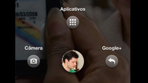

No último dia 04 de abril (semana passada) aconteceu o evento de lançamento da nova funcionalidade do _Facebook_ 
chamada de "_Home_". Este novo recurso foi apresentado pelo próprio _Mark Zunckerberg_, a funcionalidade está 
disponível para _smartphones_ que possuem o sistema operacional _Android_.

Com o objetivo de transformar qualquer celular em um dispositivo personalizado na rede social, o _Home_ irá utilizar a 
tela inicial do celular como página inicial do _Facebook_, que irá sobrepor os demais aplicativos de seu dispositivo, 
assim ao ligar seu aparelho você estará conectado ao _Facebook_.

Ou seja, você poderá acompanhar o que os seus amigos estão fazendo: as últimas postagens; fotos; comentários; curtidas 
e mensagens recebidas.

Outra novidade é o _Chat_ que foi aperfeiçoado, passando a se chamar _Chat Head_, ele terá integração com seu SMS 
deixando-o mais dinâmico, e quando desejar encerrar a conversa basta apenas arrastar o ícone e dispensar o recurso, 
da mesma forma poderá aceitar mensagens desta funcionalidade.
Sua foto de perfil ficará na parte inferior da tela de forma constante, e para ver seus aplicativos tradicionais 
basta clicar sobre o ícone com sua foto e deslizá-lo na tela.

O aplicativo "_Home_" estará disponível por enquanto apenas para _Android_, será lançado no _Google play_ com um custo 
de USD 99,99 – inicialmente restrito ao mercado americano – no próximo dia 12 de abril e contará com atualizações 
mensais. Uma versão para _tablets_ também será lançada, mas ainda não há data definida.
