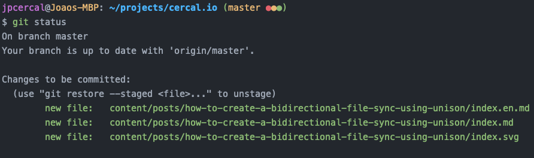
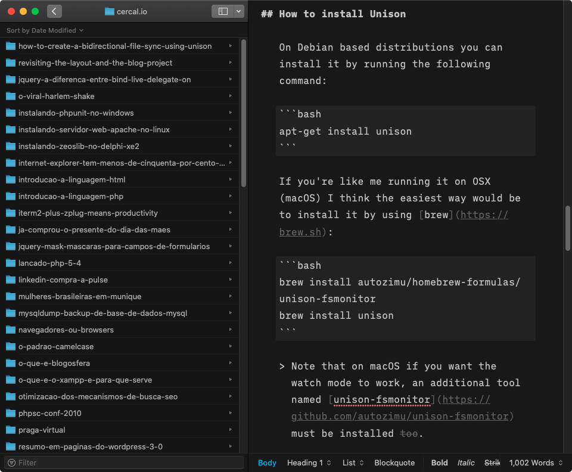

Então, se você chegou aqui, considero que já tem um problema à resolver e que você conhece a ferramenta `unison'. Se esse for o caso, pule a introdução, por favor.

Caso contrário, continue lendo, pois isso pode esclarecer algumas coisas antes de começarmos a usar o `unison` para criar uma sincronização bidirecional (two-way) de dois diretórios.

# Introdução

Para simplificar o entendimento, vamos imaginar que você tem duas pastas e deseja que ambas sejam sincronizadas quando um evento acontecer, como quando um novo arquivo é criado, um arquivo tenha sido alterado ou até mesmo um arquivo que tenha sido excluído. Você deseja que ambas as pastas reflitam exatamente o mesmo estado, como uma réplica.

Existem diferentes ferramentas disponíveis para alcançar isto dada a situação mencionada antes, mas vamos falar sobre [unison](https://www.cis.upenn.edu/~bcpierce/unison/) hoje.

## O que é `unison` e como ele pode nos ajudar?

De acordo com o projeto oficial, `unison` é uma ferramenta de sincronização de arquivos para OSX (macOS), Unix e Windows. Tem características comuns sendo compartilhadas com outras ferramentas famosas, no entanto, existem vários pontos onde ele difere, para mencionar alguns deles:

- Permite a comunicação entre diferentes sistemas, onde você pode sincronizar um laptop Windows com um servidor Unix.
- Como ele pode propagar eventos em ambas as direções, o `unison` mostra-se uma ferramenta muito útil para sincronização de arquivos bidirecionais.
- O `unison` é executado em um programa de nível de usuário, portanto, você não precisa ter privilégios de super-usuário para usá-lo.
- A ferramenta é totalmente gratuita e o código-fonte está disponível sob a licença pública GNU.

# Nosso problema

Como sou um grande fã de automação, queria escrever no meu iPhone ou iPad enquanto estava fora de casa ou mesmo em alguns momentos onde posso me ver com alguns pensamentos enquanto relaxo no sofá. Por isso comprei ano passado a licença do [iA Writer](https://ia.net/writer) para macOS e iOS para fazer anotações de tudo e ao mesmo tempo fazer uso da [sintaxe markdown](https://www.markdownguide.org/basic-syntax/). O problema é que todos os artigos deste blog estão escritos em arquivos Markdown, não há banco de dados, mas o repositório git disponível no GitHub.

> Se você quiser conferir o projeto, dê uma olhada neste post onde conto um pouco mais da arquitetura do blog e como eu gerei o site final através de uma integração com o TravisCI.
> .

O problema que tive é que queria salvar o conteúdo dos artigos no meu iPad, mas quando estava no PC queria enviar o arquivo para o repositório e ver como ficaria em um modo de visualização a postagem do blog (antes de enviar para produção).

Para conseguir isso, decidi sincronizar minha subpasta do [iCloud](https://www.icloud.com) (aquela que contém todas as postagens do blog sincronizadas pelo iA Writer) com uma pasta específica do [repositório git `./content/posts/`](https://github.com/jpcercal/cercal.io/tree/master/content/posts). E funcionou perfeitamente. Veja como fazer isso abaixo.

## Como instalar o Unison

Em distribuições baseadas em Debian, você pode instalá-lo executando o seguinte comando:

```bash
apt-get install unison
```

Se você (assim como eu) está trabalhando com um OSX (macOS), acho que a maneira mais fácil seria instalá-lo usando [brew](https://brew.sh):

```bash
brew install autozimu/homebrew-formulas/unison-fsmonitor
brew install unison
```

> Observe que no macOS, se você quiser que o modo de observação (watch), uma ferramenta adicional chamada [unison-fsmonitor](https://github.com/autozimu/unison-fsmonitor) também deve ser instalada.

Se você estiver usando o Windows, acho que o [chocolatey](https://chocolatey.org) pode ser uma boa solução para permanecer na linha de comando. No entanto, eu não testei.

```bash
choco install unison
```

> Há também a página de binários pré-compilados que pode ajudá-lo a instalar a ferramenta diretamente, mas o trabalho vai ser manual. Desculpe.
> Confira em [http://unison-binaries.inria.fr](http://unison-binaries.inria.fr).

## Como habilitar a sincronização bidirecional (two-way) de duas pastas

A solução é bastante simples, você só precisa executar o seguinte comando:

```bash
unison \
  -repeat watch \
  -copyonconflict \
  -prefer newer \
  -ignore 'Name {.DS_Store}' \
  "/Users/jpcercal/projects/cercal.io/content/posts" \
  "/Users/jpcercal/Library/Mobile Documents/27N4MQEA55~pro~writer/Documents/cercal.io"
```

Um entendimento básico sobre o que o comando acima está fazendo:

- `-repeat watch` diz ao `unison` que queremos monitorar as mudanças e sincronizar essas mudanças incrementalmente conforme necessário.
- `-copyonconflict -prefer newer` informa que queremos que os conflitos sejam resolvidos automaticamente e que preferimos a versão mais recente se isso acontecer.
- `-ignore` como o nome sugere, ignore todas as mudanças relacionadas ao padrão `'Name {.DS_Store}'`.
- `"/Users/jpcercal/projects/cercal.io/content/posts"` é meu repositório git apontando para a pasta [./content/posts/](https://github.com/jpcercal/cercal.io/tree/master/content/posts).
- `"/Users/jpcercal/Library/Mobile Documents/27N4MQEA55~pro~writer/Documents/cercal.io"` é a minha pasta do iCloud, permitindo-me sincronizar qualquer conteúdo do diretório iCloud com meu diretório local.

> `-ignore` pode ser interessante para você se você planeja sincronizar uma pasta raiz de um projeto que geralmente tem dependências de terceiros como a pasta `vendor` em projetos PHP ou `node_modules` em Javascript. Por exemplo, se você deseja ignorar os dois, pode fazer algo como:
> `-ignore 'Name {node_modules,vendor,composer.lock,package-lock.json,.DS_Store}'`.

O comando acima começará a fazer a sincronização dos arquivos e ficará assim:

```bash
jpcercal@Joaos-MBP: ~/projects/cercal.io (master ●●●)
→3 $ unison \
  -repeat watch \
  -copyonconflict \
  -prefer newer \
  -ignore 'Name {.DS_Store}' \
  "/Users/jpcercal/projects/cercal.io/content/posts" \
  "/Users/jpcercal/Library/Mobile Documents/27N4MQEA55~pro~writer/Documents/cercal.io"
Unison 2.51.2 (ocaml 4.08.1): Contacting server...
Looking for changes
Reconciling changes
         <---- deleted    how-to-create-a-bidirectional-file-sync-using-unison/25.png
posts        : unchanged file     modified on 2020-08-26 at 10:06:28  size 32672     rw-r--r--
cercal.io    : deleted
         <---- new file   how-to-create-a-bidirectional-file-sync-using-unison/git-status.png
posts        : absent
cercal.io    : new file           modified on 2020-08-26 at 19:53:38  size 49486     rw-r--r--
         <---- new file   how-to-create-a-bidirectional-file-sync-using-unison/ia-writer-blog-posts.png
posts        : absent
cercal.io    : new file           modified on 2020-08-26 at 19:49:26  size 178662    rw-r--r--
         <---- changed    how-to-create-a-bidirectional-file-sync-using-unison/index.en.md
posts        : unchanged file     modified on 2020-08-26 at  6:42:09  size 348       rw-r--r--
cercal.io    : changed file       modified on 2020-08-26 at 20:06:47  size 7503      rw-r--r--
         <---- changed    revisiting-the-layout-and-the-blog-project/index.md
posts        : unchanged file     modified on 2020-08-25 at 18:46:23  size 9898      rw-r--r--
cercal.io    : changed file       modified on 2020-08-26 at 19:14:52  size 9896      rw-r--r--
Propagating updates
UNISON 2.51.2 (OCAML 4.08.1) started propagating changes at 20:06:50.68 on 26 Aug 2020
[BGN] Copying how-to-create-a-bidirectional-file-sync-using-unison/git-status.png from /Users/jpcercal/Library/Mobile Documents/27N4MQEA55~pro~writer/Documents/cercal.io to /Users/jpcercal/projects/cercal.io/content/posts
[END] Copying how-to-create-a-bidirectional-file-sync-using-unison/git-status.png
[BGN] Copying how-to-create-a-bidirectional-file-sync-using-unison/ia-writer-blog-posts.png from /Users/jpcercal/Library/Mobile Documents/27N4MQEA55~pro~writer/Documents/cercal.io to /Users/jpcercal/projects/cercal.io/content/posts
[END] Copying how-to-create-a-bidirectional-file-sync-using-unison/ia-writer-blog-posts.png
[BGN] Updating file how-to-create-a-bidirectional-file-sync-using-unison/index.en.md from /Users/jpcercal/Library/Mobile Documents/27N4MQEA55~pro~writer/Documents/cercal.io to /Users/jpcercal/projects/cercal.io/content/posts
[END] Updating file how-to-create-a-bidirectional-file-sync-using-unison/index.en.md
[BGN] Updating file revisiting-the-layout-and-the-blog-project/index.md from /Users/jpcercal/Library/Mobile Documents/27N4MQEA55~pro~writer/Documents/cercal.io to /Users/jpcercal/projects/cercal.io/content/posts
[END] Updating file revisiting-the-layout-and-the-blog-project/index.md
[BGN] Deleting how-to-create-a-bidirectional-file-sync-using-unison/25.png from /Users/jpcercal/projects/cercal.io/content/posts
[END] Deleting how-to-create-a-bidirectional-file-sync-using-unison/25.png
UNISON 2.51.2 (OCAML 4.08.1) finished propagating changes at 20:06:50.68 on 26 Aug 2020
Saving synchronizer state
Synchronization complete at 20:06:50  (5 items transferred, 0 skipped, 0 failed)
Looking for changes
Reconciling changes
Nothing to do: replicas have not changed since last sync.
```

O script ficará aguardando que novas alterações sejam sincronizadas se você quiser encerrar a execução, basta pressionar `CTRL-C` e o processo será interrompido.

### Capturas de tela

Mostra o comando `git status` e as atualizações que vieram do iA Writer após a execução da sincronização.



Mostra o iA Writer com a biblioteca de postagens à esquerda e o editor à direita.



> Espero que agora você entenda como usar o `unison` para sincronizar dois diretórios bi-direcionalmente, se você tiver alguma dúvida ou sugestão, por favor deixe-me um comentário ou entre em contato comigo através das minhas redes sociais. Obrigado! =)