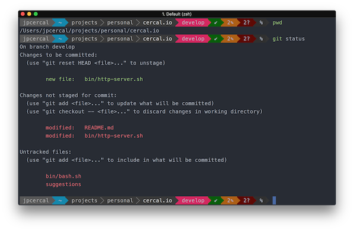
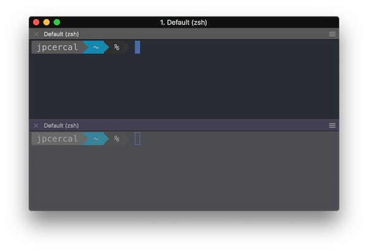
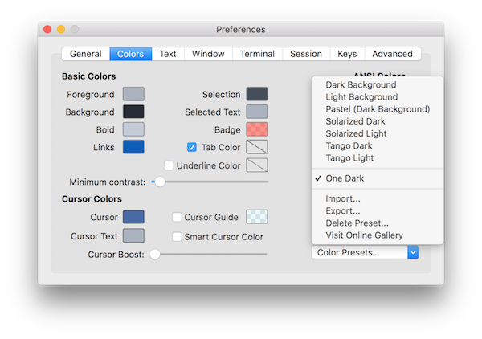
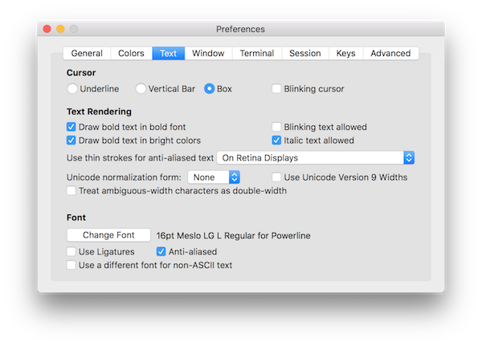

After spending a long time of my life using the normal terminal I met a new tool called iTerm2 because a friend of mine a few years ago. And, this week I've discovered the power of zplug. So, here's a brief tutorial on how to get something looking similar to this:



## iTerm2

This is a tool like the native app for terminal provided by Apple that has a lot of features that you can just [check here](https://www.iterm2.com/). It allows you to customize everything from autocomplete to syntax highlight.

But the most interesting feature for me is called `Split Panes`.

### `Cmd ⌘ + D` split pane vertically 


### `Cmd ⌘ + Shift + D` split pane horizontally



### Colors scheme

To continue with the customization of your terminal we'll install the `One Dark` color scheme in your iTerm app.

```shell
git clone -b master --depth=1 https://github.com/bahlo/iterm-colors.git ~/iterm-colors
```

This command will download some presets including `One Dark` theme. In order to install it on iTerm press `Cmd ⌘ + I` and go to `Colors > Color Presets > Import...`, there you can select the preset that you would like to import.

Note that the presets are living inside of the directory `~/iterm-colors/colors/*.itermcolors`.



### Meslo Font

Another thing to install is a good font, I'm using `Meslo` if you want the same you can install doing this:

```shell
git clone https://github.com/powerline/fonts.git && cd fonts && ./install.sh
```

And, to use this font on iTerm press `Cmd ⌘ + I` and to go `Text > Change Font > Family > Meslo LG L for Powerline`. Don't forget to disable the option `Use a different font for non-ASCII text`.




## Zplug

It's a Zsh Plugin Manager like oh-my-zsh, prezto and antigen.

Some advantages according to the [project page](https://github.com/zplug/zplug):

* Can manage everything
    * Zsh plugins/UNIX commands on GitHub and Bitbucket
    * Gist files (gist.github.com)
    * Externally managed plugins e.g., oh-my-zsh and prezto plugins/themes
    * Binary artifacts on GitHub Releases
    * Local plugins
    * etc. (you can add your own sources!)
* Super-fast parallel installation/update
* Support for lazy-loading
* Branch/tag/commit support
* Post-update, post-load hooks
* Dependencies between packages
* Unlike antigen, no ZSH plugin file (*.plugin.zsh) required
* Interactive interface (fzf, peco, zaw, and so on)
* Cache mechanism for reducing the startup time

This is a framework for managing your zsh configuration. In order to install this tool, you should run this command:

```shell
brew install zplug
```

### My configuration file `~/.zshrc`

This is the configuration file that I'm using now. To be able to use this one you must install this dependencies before proceed:

```shell
pip install psutil
pip install powerline-shell
brew install peco
```

Now, copy and paste this content to your `~/.zshrc` file.

```shell
###########################################################
# Pre configuration

# Define the environment variable ZPLUG_HOME 
export ZPLUG_HOME=/usr/local/opt/zplug

# Loads zplug
source $ZPLUG_HOME/init.zsh

# Clear packages
zplug clear

###########################################################
# Packages

zplug "zsh-users/zsh-syntax-highlighting"
zplug "zsh-users/zsh-autosuggestions"
zplug "zsh-users/zsh-completions"
zplug "paulmelnikow/zsh-startup-timer"
zplug "tysonwolker/iterm-tab-colors"
zplug "desyncr/auto-ls"
zplug "momo-lab/zsh-abbrev-alias"
zplug "rawkode/zsh-docker-run"
zplug "arzzen/calc.plugin.zsh"
zplug "peterhurford/up.zsh"
zplug "jimeh/zsh-peco-history"
  
###########################################################
# Theme

zplug "b-ryan/powerline-shell"

function powerline_precmd() {
    PS1="$(powerline-shell --shell zsh $?)"
}

function install_powerline_precmd() {
  for s in ${precmd_functions[@]}; do
    if [ "$s" = "powerline_precmd" ]; then
      return
    fi
  done
  precmd_functions+=(powerline_precmd)
}

if [ "$TERM" != "linux" ]; then
    install_powerline_precmd
fi

###########################################################
# Install packages that have not been installed yet
if ! zplug check --verbose; then
    printf "Install? [y/N]: "
    if read -q; then
        echo; zplug install
    else
        echo
    fi
fi

zplug load

###########################################################
# Post configuration

# Aliases
abbrev-alias -g G="| grep"

# Docker images
function npm() {
  run_with_docker "node" "alpine" "npm" $@
}

function go() {
  run_with_docker "golang" "latest" "go" $@
}

function php() {
  run_with_docker "php" "latest" "php" $@
}

```

This file will be loaded each time that you start a new session using your terminal, so during the next session you should see a question there because you don't have the plugins yet `Install? [y/N]: `, after the installation you should be able to have a terminal like I have here.

Let me know if you have questions about this process.

Note that the focus of this tutorial was to have it working on OSX but I'm pretty sure that's possible to have the same environment running on Linux or Windows but without iTerm since this app is just available for OSX.
