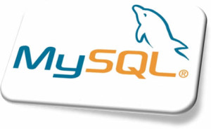

Utilizando a ferramenta **mysqldump**, você poderá realizar o backup de uma base de dados local e restaura-la para uma 
base de dados remota com as mesmas características, tudo isso utilizando um simples comando. Em seguida, você verá na 
prática exemplos de utilização da ferramenta **mysqldump** realizando a exportação e importação de bases de dados 
_MySQL_.

Abaixo está um exemplo de exportação:

```shell
$ mysqldump -u [USERNAME] -p[PASSWORD] [DATABASE-NAME] > dumpfilename.sql
```

E para importar a base de dados:

```shell
$ mysql -u [USERNAME] -p[PASSWORD] [DATABASE-NAME] < dumpfilename.sql
```

Com base na sintaxe apresentada acima, digamos que haja um banco de dados chamado "exemplo", e queremos exporta-lo. 
Para isto, executaríamos o seguinte comando:

```shell
$ mysqldump -u root exemplo > exemplo.sql
```

Este comando iria exportar todo o conteúdo presente na base de dados "exemplo" para um arquivo chamado "exemplo.sql".

Uma vez que temos a nossa base de dados exportada, em um outro banco de dados (por exemplo o banco presente no ambiente 
de produção) no qual desejamos importar o banco de dados exportado anteriormente, executaríamos o seguinte comando:

```shell
$ mysql -u root exemplo < exemplo.sql
```

Conseguimos também importar uma base de dados conectando no mysql e por lá executar o comando source para importar a 
base de dados, para isso usamos a seguinte sequência de comandos:

```shell
$ mysql -u root
```

```shell
$ mysql> use exemplo;
```

```shell
$ mysql> source /home/usuario/dump/dumpfilename.sql
```

**1\. Backup de N bases de dados simultaneamente:**

Se a sua intenção for realizar um backup de N bases de dados simultaneamente, primeiramente você precisará identificar 
quais são os nomes dos bancos de dados que deseja efetuar a exportação. Para fazer isto, poderá se conectar no banco 
de dados com o seguinte comando:

```shell
$ mysql -u root
```

Após se conectar, poderá listar o nome dos bancos de dados através do seguinte comando:



```shell
$ mysql> show databases;
```

A saída do comando é representada abaixo:

```shell
$ mysql> show databases;
+--------------------+
| Database |
+--------------------+
| information_schema |
| clientes |
| mysql |
| exemplo |
+--------------------+
4 rows in set (0.00 sec)
```

Se você quiser exportar a base de dados cliente e a base de dados exemplo, poderia executar a ferramenta utilizando 
a seguinte sintaxe:

```shell
$ mysqldump -u root --databases <DATABASE-NAME-1 DATABASE-NAME-2 DATABASE-NAME-N> > dumpfilename.sql
```

Sendo assim, nosso comando ficaria assim:

```shell
$ mysqldump -u root --databases clientes exemplo > clientes_exemplo.sql
```

**2\. Backup de todas as bases de dados:**

O seguinte comando iria efetuar o backup de todos os bancos de dados:

```shell
$ mysqldump -u root --all-databases > dumpfilename.sql
```

**3\. Backup de uma tabela específica**

Se a tua intenção é realizar o backup de uma tabela específica presente dentro de um banco de dados, poderá utilizar 
a seguinte sintaxe:

```shell
$ mysqldump -u <DATABASE-NAME> <TABLE-NAME> > dumpfilename.sql
```

Logo se quisessemos exportar uma tabela chamada "tabela1″ presente dentro do banco de dados chamado "exemplo", 
utilizaríamos o seguinte comando:

```shell
$ mysqldump -u root exemplo tabela1 > exemplo_tabela1.sql
```

Bem, isso é tudo pessoal.

> Dúvidas? **Deixe um comentário!**
